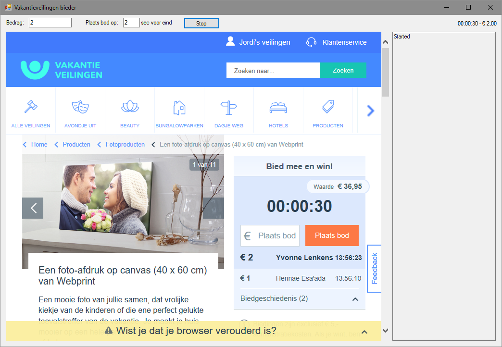

# VakantieVeilingenBieder
Automatisch bieden op VakantieVeilingen.nl

## Werking
1) Start de applicatie
2) Log in
3) Ga naar de juiste veilingpagina
4) Vul je biedingbedrag in (heel getal, geen komma's)
5) Druk op start :)

De applicatie gaat nu automatisch jouw bod plaatsen voordat de veiling is afgelopen, mits je bod hoger is dan het huidige hoogste bod.
Indien je niet gewonnen hebt wordt de pagina herladen om de volgende veiling te starten.
Indien je wel gewonnen hebt zal de applicatie stoppen.

## Waarom deze applicatie gebruiken?
 - Je wil graag een veiling winnen, maar er niet de hoofdprijs voor betalen
 - Niet meer in de gaten hoeven houden wanneer een veiling afloopt
 - Gemak; je krijgt vanzelf een mail als je gewonnen hebt
 - Log van de hoogste biedingen van afgelopen veilingen
 - Niet in de verleiding komen hoger te bieden dan je zou willen

## Contact
Voor vragen kun je mailen op: vv-github@jordijolink.nl

## Disclaimer
Deze code is in een halfuurtje gemaakt. Let dus niet op de kwaliteit. Geen comments, slechte namen, hybride-taaltgebruik, geen asynchroniteit, geen goede exception handling, etc.
